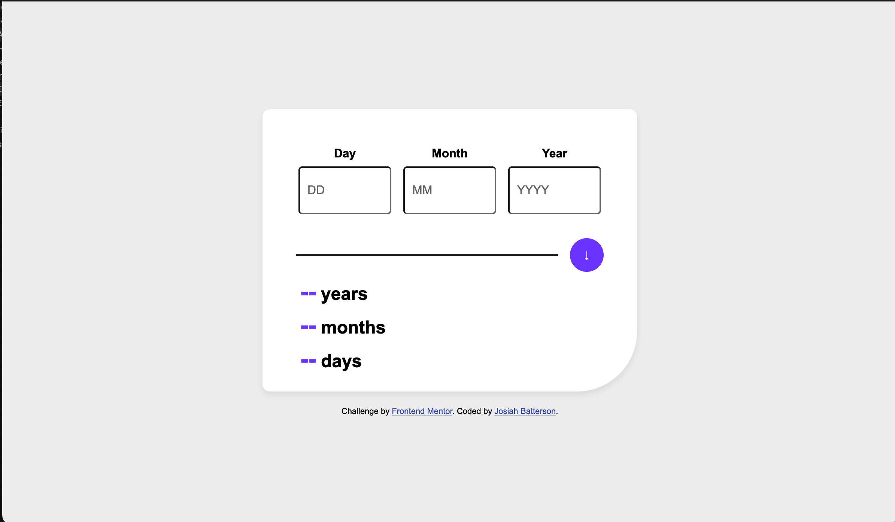
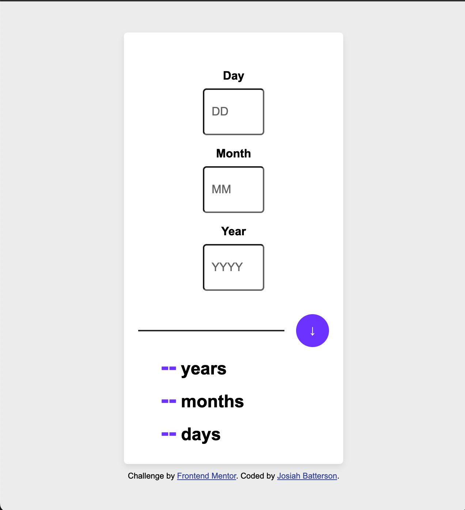

# Frontend Mentor - Age calculator app solution

This is a solution to the [Age calculator app challenge on Frontend Mentor](https://www.frontendmentor.io/challenges/age-calculator-app-dF9DFFpj-Q). Frontend Mentor challenges help you improve your coding skills by building realistic projects.

## Table of contents

- [Overview](#overview)
  - [The challenge](#the-challenge)
  - [Screenshot](#screenshot)
  - [Links](#links)
- [My process](#my-process)
  - [Built with](#built-with)
  - [What I learned](#what-i-learned)
  - [Useful resources](#useful-resources)

## Overview

### The challenge

Users should be able to:

- View an age in years, months, and days after submitting a valid date through the form
- Receive validation errors if:
  - Any field is empty when the form is submitted
  - The day number is not between 1-31
  - The month number is not between 1-12
  - The year is in the future
  - The date is invalid e.g. 31/04/1991 (there are 30 days in April)
- View the optimal layout for the interface depending on their device's screen size
- See hover and focus states for all interactive elements on the page
- **Bonus**: See the age numbers animate to their final number when the form is submitted

### Screenshot




### Links

- Solution URL: [https://github.com/SiahBatterson/frontend-junior-project]
- Live Site URL: [https://siahbatterson.github.io/frontend-junior-project/]

## My process

My process is always to start with laying everything out first. I like getting styling done in CSS to get an approximate mark up of what it might look like so as I build out the app I can see how a user might interact with it. First I did the HTML, then the CSS, and then I implimented the js using the date functions and constructors in js.

It was straightforward from there making the calculations and then having it check for errors and then adding media queries so that the app would be responsive on web.

### Built with

- Semantic HTML5 markup
- Flexbox
- Mobile-first workflow
- Java Script

### What I learned

One of the peices that was cruciual to my responsive design for mobile was the media queries.

```css
@media only screen and (max-width: 720px) {
  .input-group input {
    width: 60px;
    padding: 10px;
    height: 40px;
    font-size: 1rem;
  }
  .container {
    border-radius: 5px;
    margin-bottom: 10px;
    width: 200px;
    max-width: 90%;
  }
  .line {
    width: 200px;
    margin: 0;
    padding: 0;
    height: 2px;
    background-color: #333;
  }

  .button-line-container {
    display: flex;
    align-items: center;
    gap: 1rem;
    justify-content: center;
    margin-top: 1rem;
  }
}
```

It was crucial to have everthing laid out correctly in a flex container so that it would work correctly.

```html
<div class="container">
  <form id="date-form">
    <div class="form-group">
      <div class="input-group">
        <label for="day">Day</label>
        <input type="number" id="day" placeholder="DD" />
      </div>
      <div class="input-group">
        <label for="month">Month</label>
        <input type="number" id="month" placeholder="MM" />
      </div>
      <div class="input-group">
        <label for="year">Year</label>
        <input type="number" id="year" placeholder="YYYY" />
      </div>
    </div>
    <div class="button-line-container">
      <div class="line"></div>
      <button type="submit">↓</button>
    </div>
  </form>
  <div class="result">
    <p><span id="years">--</span> years</p>
    <p><span id="months">--</span> months</p>
    <p><span id="days">--</span> days</p>
  </div>
</div>
```

I also kept struggling with the form and buttons resseting itself and a helpful peice of code I came across while problem solving is the porevent default function for inputs.

```js
form.addEventListener("submit", (e) => {
  e.preventDefault();
  calculateAge();
});
};
```

### Useful resources

- [CSS flexbox styling guide](https://css-tricks.com/snippets/css/a-guide-to-flexbox/#aa-flexbox-tricks) - Flex boxes continiue to stump me but this guide seemed to be very helpful for underastanding them on a more fundamental level.
- [Debugging tips](https://www.youtube.com/watch?v=ndeClnyHSo8) - This video was helpful in learning helpful ways to debug especially using the style section of the dev tools.
